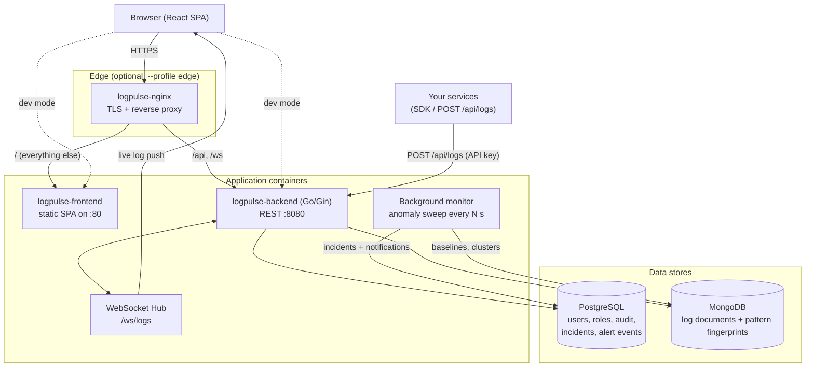
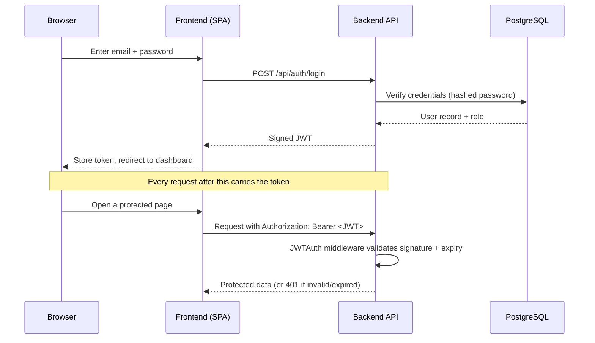
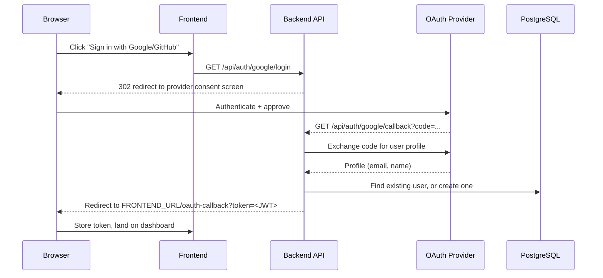
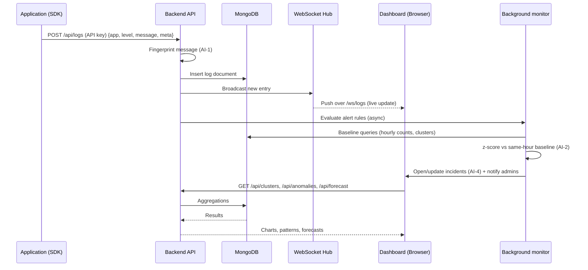
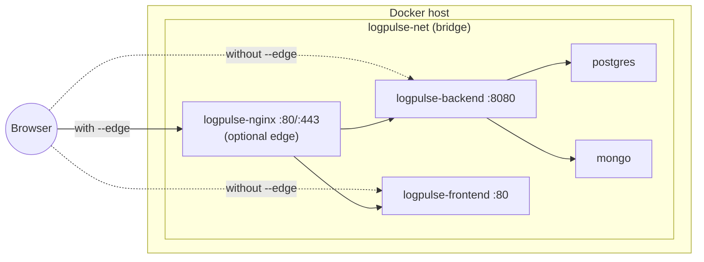

# LogPulse

Centralized log monitoring: ingest, search, and stream application logs live —
with **AI-native insights** (clustering, anomaly detection, root-cause
analysis, forecasting), threshold **alerting with triage**, role-based auth
(email/password + Google/GitHub OAuth), and SDKs for Go, Node, and Python.

```
logpulse/
├── backend/           Go/Gin API, Postgres (auth/users) + Mongo (logs), WebSocket stream
│   └── internal/monitor/   AI-1..AI-8: clustering, anomalies, incidents, forecast, copilot
├── frontend/          React/Vite dashboard (dark/light, live charts)
├── sdk/               Go · Node/TypeScript · Python clients + framework middleware
├── deployment/        Docker Compose stack, nginx, env template, deploy script
└── docs/
    ├── DEPLOYMENT_GUIDE.md   how to run the stack (incl. free hosting)
    ├── SDK_GUIDE.md          SDK quickstarts, building, publishing, free deployment
    └── FRD.md                functional requirements + implementation status
```

## Architecture



## What's built

**Core (MVP)**

- Auth: email/password + Google/GitHub OAuth, JWT, role-based access, invite-only signup, admin bootstrap, audit log
- Log ingestion behind per-app API keys, live WebSocket stream, search & filter
- Applications registry, saved searches, custom dashboards, reports/exports, in-app notifications

**Advanced monitoring (AI-native, zero external APIs — see `docs/FRD.md` §4)**

- **AI-1 Clustering & dedup** — messages are fingerprinted at ingest; Analytics collapses near-duplicates into patterns with live counts ("15.6K lines → 19 patterns")
- **AI-2 Anomaly detection** — background sweep learns each app's hour-of-day volume/error baselines and flags z ≥ 3 deviations (spikes, error-rate surges, silent services) automatically
- **AI-4 Cross-service correlation** — anomalies co-occurring across services open ONE correlated incident
- **AI-5 Root-cause copilot** — per-incident analysis: timeline, dominant failure signatures, field hints, and ranked hypotheses with cited log-line evidence (suggestions, never auto-actions)
- **AI-6 Alert triage** — per-rule cooldowns suppress duplicate pages; alert events link to incidents
- **AI-7 Volume forecasting** — 24h forecast with confidence band, daily growth %, 30-day storage projection
- **AI-8 NL alert authoring** — "alert me when payments-api has more than 10 errors mentioning timeout within 5 minutes" → reviewed draft rule

**SDKs (see `docs/SDK_GUIDE.md`)**

- Go, Node/TypeScript, Python clients with async buffering + framework middleware (Gin, Express, FastAPI, Flask)

## Auth flow (email/password + JWT)



## Auth flow (Google / GitHub OAuth)



## Log ingestion & monitoring flow



## Deployment topology (Docker Compose)



## Run it with Docker (recommended)

```bash
cd deployment
cp .env.example .env      # edit JWT_SECRET, POSTGRES_PASSWORD, SEED_ADMIN_PASSWORD
./scripts/deploy.sh       # add --edge for the single-entrypoint nginx
```

Frontend: `http://localhost:5173` · Backend: `http://localhost:8080`
Full details, ports, and TLS: see `docs/DEPLOYMENT_GUIDE.md`.

## Run it locally without Docker (day-to-day dev)

```bash
# 1. databases only, with ports published to the host
cd deployment
docker compose -f docker-compose.yml -f docker-compose.dev.yml up -d postgres mongo

# 2. backend (reads env vars; there is no .env loader)
cd ../backend
export POSTGRES_DSN="host=127.0.0.1 user=logpulse password=... dbname=logpulse port=5432 sslmode=disable"
export MONGO_URI="mongodb://127.0.0.1:27017" MONGO_DB=logpulse JWT_SECRET=dev-secret
export FRONTEND_URL=http://localhost:5173 SEED_ADMIN_EMAIL=admin@logpulse.io SEED_ADMIN_PASSWORD=changeme123
go run ./cmd/server        # http://localhost:8080, check GET /health

# 2b. optional: seed a week of demo logs (clusters, anomalies, forecast data)
MONGO_URI=mongodb://127.0.0.1:27017 go run ./cmd/seeddev

# 3. frontend
cd ../frontend
npm install
npm run dev                 # http://localhost:5173, proxies /api and /ws
```

> Windows + WSL2 tip: prefer `127.0.0.1` over `localhost` in DSNs — `localhost`
> may resolve to a WSL relay instead of Docker.

## Try it end to end

1. Log in at `/login` (bootstrap admin credentials are in your env,
   `SEED_ADMIN_EMAIL` / `SEED_ADMIN_PASSWORD`).
2. Register an application (Applications page) and copy its API key.
3. Send a test log:
   ```bash
   curl -X POST http://localhost:8080/api/logs \
     -H "Authorization: Bearer <APPLICATION_API_KEY>" \
     -H "Content-Type: application/json" \
     -d '{"app_name":"payments-api","level":"error","message":"failed to charge card"}'
   ```
4. Watch it appear live on the dashboard; check **Analytics** for clusters and
   forecasts, **System Health** for per-app status, and describe an alert in
   words on the **Alerts** page.

## What's next

See `docs/FRD.md` for the full requirement list and status: semantic search
(AI-3), OpenTelemetry ingestion, Java/.NET SDKs, and client-side PII scrubbing
are the remaining roadmap items.
