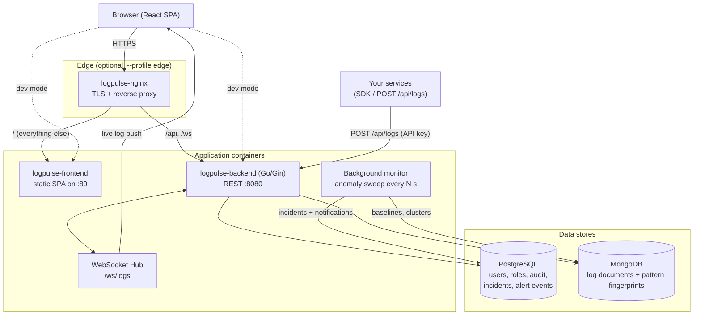
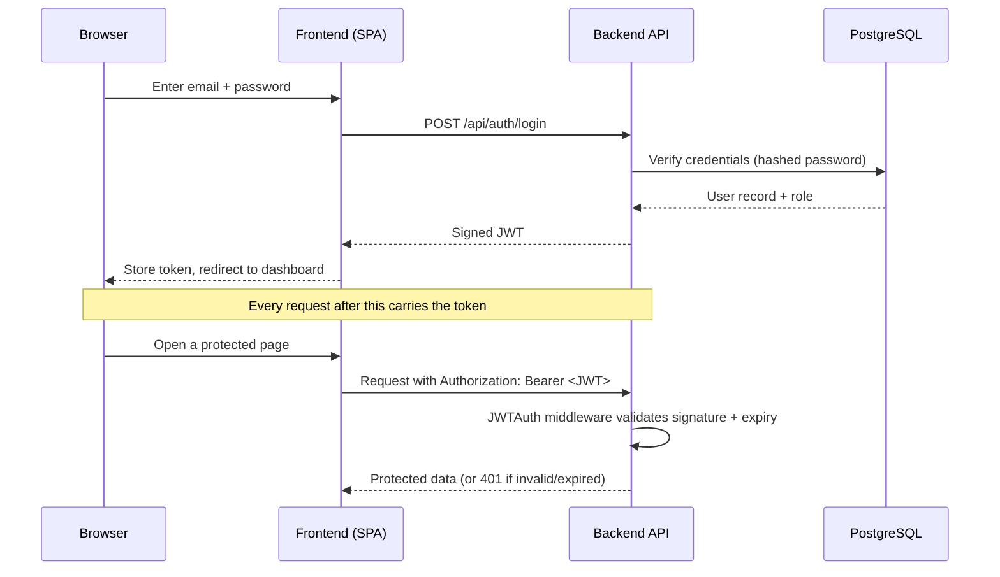
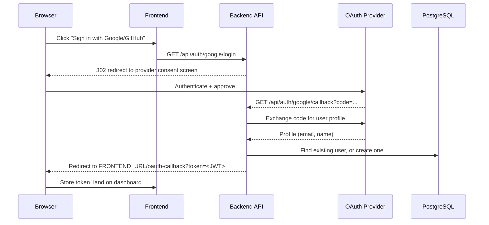
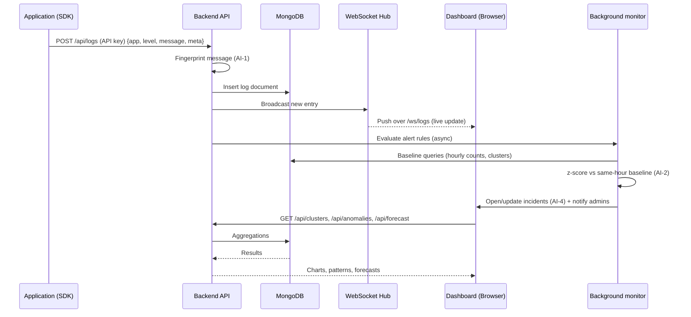
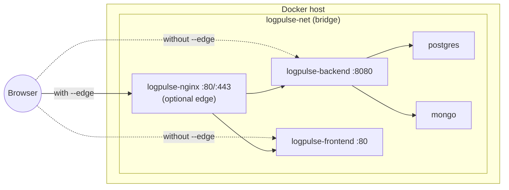

# Architecture

LogPulse is a Go (Gin) REST + WebSocket API, a React/Vite SPA, PostgreSQL for
structured data (users, roles, incidents, alert events), and MongoDB for log
documents. The diagrams below are the same ones maintained in the project
README.

## System overview

## Auth flow (email/password + JWT)

## Auth flow (Google / GitHub OAuth)

## Log ingestion & monitoring flow

## Deployment topology (Docker Compose)

## Monitoring pipeline

The AI-native features live in `backend/internal/monitor/`. They are
deterministic — no external model calls, no data leaving the deployment.

| File | Responsibility |
|------|----------------|
| `fingerprint.go` | Normalizes a message into a pattern template (`<id>`, `<num>`, `<ip>`, `<uuid>`, `<url>`, `<str>`) and hashes it (AI-1) |
| `aggregate.go` | All Mongo aggregations: timeseries, top apps, clusters, per-app health, overview |
| `detector.go` | Baselines + z-score detection, incident upsert/correlation, background sweep loop (AI-2, AI-4, AI-6) |
| `forecast.go` | Linear trend + hour-of-day profile, 24h prediction with ±1.5σ band (AI-7) |
| `copilot.go` | Evidence-first incident analysis: timeline, signatures, field hints, hypotheses (AI-5) |
| `nlalert.go` | Plain-language → draft alert rule parser (AI-8) |

Detection details:

- **Baseline** — the last *complete* hour is compared against the same
  hour-of-day across the past 7 days, so daily rhythm doesn't cause false
  alarms. The in-progress hour is never scored.
- **Volume spike** — z ≥ 3 against the same-hour profile (std regularized
  because 7 samples is few), and observed ≥ max(5, 2× expected).
- **Error rate** — Wald z-test of the observed hour's error share against
  the pooled weekly rate; needs ≥ 20 logs in the hour.
- **Silence** — a precise raw count for the last 15 minutes; zero with a
  baseline that predicts real traffic flags a probable outage.
- **Correlation** — ≥ 2 apps anomalous in the same sweep → one incident
  listing all affected services, instead of separate pages.

All findings are *suggestions*: incidents are opened and updated, evidence is
stored and shown, but nothing is auto-resolved and no message is sent to a
human without a corresponding notification the operator can dismiss.

## Data model

| Store | Data |
|-------|------|
| PostgreSQL | `users`, `applications`, `alert_rules`, `alert_events`, `incidents`, `audit_logs`, `saved_searches`, `dashboards`, `dashboard_widgets`, `reports`, `notifications` |
| MongoDB | `logs` — one document per entry, with `pattern_hash` / `pattern` fields added at ingest |
